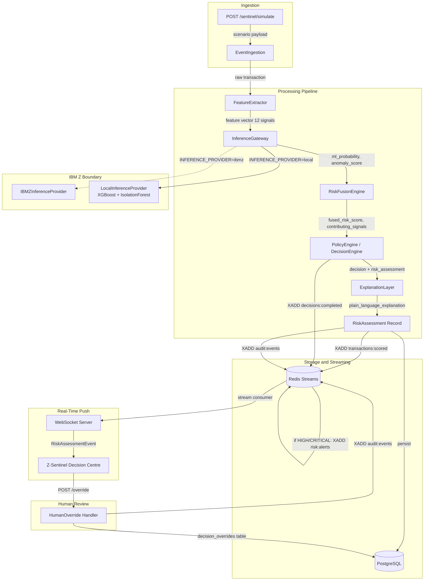
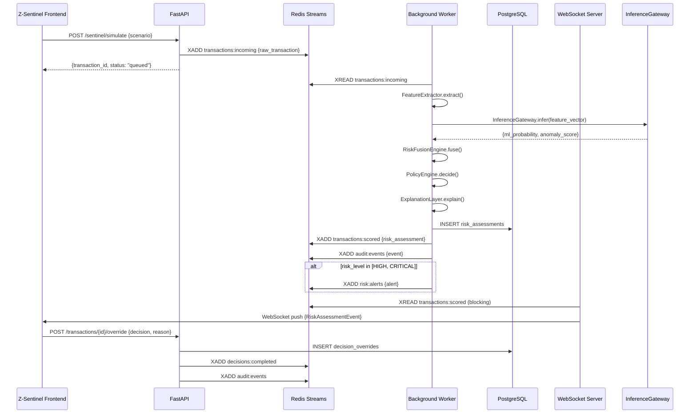

# Design Document: ArthaMind Z-Sentinel

**Tagline**: Real-Time AI for Critical Financial Decisions  
**Feature**: arthamind-z-sentinel  
**Workflow**: Design-First (High-Level + Low-Level)

---

## Overview

ArthaMind Z-Sentinel is the real-time fraud detection and risk decision engine for the ArthaMind AI Banking Simulator. It closes the gap between the existing scaffolding and a fully functioning, demo-ready product.

### Gap Analysis

#### What EXISTS and must be preserved

| Layer | Status |
|---|---|
| FastAPI middleware stack (CORS, GZip, rate-limit, request-ID, exception handlers) | ✅ Live |
| Pydantic BaseSettings — JWT, Redis, PostgreSQL, ChromaDB, Gemini all configured | ✅ Live |
| `/health` and `/ready` routes | ✅ Live |
| React 18 + TypeScript + Vite + Tailwind + react-router-dom v6 + axios + @tanstack/react-query | ✅ Live |
| Frontend portals: CustomerPortal (13 pages), AgentPortal, ManagerPortal | ✅ Live (mock data) |
| FraudAwareness quiz + threat cards UI | ✅ Live (hardcoded) |
| Docker Compose: PostgreSQL 16, Redis 7, ChromaDB 0.4.24 | ✅ Live |
| CI/CD: GitHub Actions (pytest, mypy, vitest, tsc, docker build, security scan) | ✅ Live |

#### What MUST be built

| Gap | Impact |
|---|---|
| All backend business logic — every agent, service, model, controller is an empty stub | Blocker for every feature |
| ML training pipeline (XGBoost + IsolationForest) + artefact storage | Blocker for risk scoring |
| InferenceGateway abstraction + LocalInferenceProvider | Required for runnable demo |
| IBMZInferenceProvider integration contract | Required for IBM Z positioning |
| Risk Fusion Engine | Blocker for fused risk score |
| Decision Engine (PolicyEngine) | Blocker for APPROVE/STEP-UP/HOLD |
| Explanation Layer (GeminiExplainer + deterministic fallback) | Required for AI output contract |
| Decision Impact Simulator | Required for human review UX |
| Redis event streaming (5 channels) | Required for real-time pipeline |
| WebSocket / SSE server | Required for live frontend updates |
| PostgreSQL schema + Alembic migrations (6 new tables) | Blocker for persistence |
| Real JWT auth routes (issue / verify / refresh) | Blocker for RBAC |
| Z-Sentinel Decision Centre (`/sentinel` frontend route) | The primary demo surface |
| AI Copilot (Gemini, injection-guarded) | P1 demo differentiator |
| All 6 deterministic demo scenarios | Required for hackathon demo |
| Observability metrics endpoint | P1 |
| Audit trail (append-only, DB + Redis) | Required for security story |

---

## Architecture

### Pipeline Overview



### Redis Stream Topology

| Stream Key | Producer | Consumer | Purpose |
|---|---|---|---|
| `transactions:incoming` | `/simulate` endpoint | Background worker | Raw transaction events |
| `transactions:scored` | Background worker | WebSocket broadcaster | Scored assessments for live feed |
| `risk:alerts` | Background worker | Alert fanout | HIGH + CRITICAL only |
| `decisions:completed` | Override handler | Audit consumer | Final decisions |
| `audit:events` | All components | Audit DB writer | Append-only audit trail |

### Frontend Route Map (additive — existing routes unchanged)

```
/login          → LoginPage (unchanged)
/dashboard/*    → CustomerPortal (unchanged, still mock data in Phase 1)
/agent          → AgentPortal (unchanged)
/manager        → ManagerPortal (unchanged, real data Phase 2+)
/sentinel       → ZSentinelPage  ← NEW
```

### End-to-End Sequence



### Background Worker

- Implemented as an `asyncio.Task` started in the FastAPI `lifespan` context
- Uses `redis.asyncio` with `XREAD BLOCK 1000` — non-polling
- Processes one transaction at a time in the demo; configurable batch size via `WORKER_BATCH_SIZE`
- Error handling: dead-letter stream `transactions:failed` for pipeline errors

### WebSocket Server

- Endpoint: `WS /api/v1/sentinel/ws`
- Authenticates via JWT query param: `?token=<access_token>`
- Broadcasts `RiskAssessmentEvent` JSON to all connected clients
- Message format:

```json
{
  "event_type": "RISK_ASSESSMENT_COMPLETE",
  "transaction_id": "txn_abc123",
  "risk_level": "HIGH",
  "risk_score": 0.74,
  "decision": "HOLD",
  "timestamp": "2024-01-15T14:30:00Z"
}
```

---

## Components and Interfaces

### IBM Z Integration Boundary

#### InferenceGateway Abstract Interface

```python
from abc import ABC, abstractmethod
from dataclasses import dataclass

@dataclass
class InferenceRequest:
    transaction_id: str
    feature_vector: list[float]           # 12 signals, ordered
    customer_id: str
    model_version: str

@dataclass
class InferenceResponse:
    transaction_id: str
    ml_probability: float                 # XGBoost fraud probability [0.0–1.0]
    anomaly_score: float                  # IsolationForest normalised [0.0–1.0]
    model_version: str
    inference_mode: str                   # "LOCAL_DEMO" | "IBM_Z"
    inference_latency_ms: float

class InferenceGateway(ABC):
    @abstractmethod
    async def infer(self, request: InferenceRequest) -> InferenceResponse:
        """Run ML inference and return fraud probability + anomaly score."""
        ...

    @abstractmethod
    async def health_check(self) -> dict:
        """Return model version, status, and inference mode."""
        ...
```

#### LocalInferenceProvider (DEMO / LOCAL INFERENCE MODE)

- Loads pre-trained XGBoost and IsolationForest artefacts from `backend/models/`
- Runs entirely in-process via `joblib.load()`
- `inference_mode = "LOCAL_DEMO"`
- Activated when `INFERENCE_PROVIDER=local` (default)
- Makes the demo fully runnable with no external dependencies

#### IBMZInferenceProvider (Integration Contract)

- Activated when `INFERENCE_PROVIDER=ibmz` (env var toggle)
- Calls IBM ML for z/OS REST scoring endpoint
- Expected endpoint format: `POST https://{IBM_Z_HOST}/zosmf/analytics/v1/score`
- Required env vars:
  - `IBM_Z_HOST` — hostname of the z/OS LPAR
  - `IBM_Z_PORT` — port (default 443)
  - `IBM_Z_USERNAME` — IBM z/OS user ID
  - `IBM_Z_PASSWORD` — z/OS password or API key
  - `IBM_Z_MODEL_NAME` — registered model name in IBM ML for z/OS
- Request contract (JSON body sent to z/OS endpoint):

```json
{
  "model_name": "arthamind_fraud_detector",
  "model_version": "1.0.0",
  "inputs": [
    {
      "name": "feature_vector",
      "values": [250.00, 180.00, 1.38, 3, 8, 5411, 0, 1, 0, 14, 2, 0.62]
    }
  ]
}
```

- Response contract expected from z/OS endpoint:

```json
{
  "predictions": [
    {
      "ml_probability": 0.73,
      "anomaly_score": 0.61,
      "model_version": "1.0.0"
    }
  ],
  "inference_mode": "IBM_Z"
}
```

> **Explicit Disclaimer**: IBM Z inference is an architectural integration point designed into the system from day one. The LocalInferenceProvider makes the demo fully runnable on any machine. Actual IBM Z deployment requires an accessible z/OS environment with IBM ML for z/OS licensed and configured. The `INFERENCE_PROVIDER=ibmz` toggle is wired and documented; activation requires a live z/OS endpoint.

---

### ML Pipeline

#### Models

| Model | Role | Library |
|---|---|---|
| XGBoost | Primary supervised classifier — fraud probability | `xgboost==2.0.x` |
| RandomForest | Fallback supervised classifier | `scikit-learn` |
| IsolationForest | Unsupervised anomaly detection | `scikit-learn` |

#### Feature Vector (12 signals, fixed order)

| Index | Signal | Type | Description |
|---|---|---|---|
| 0 | `transaction_amount` | float | Raw transaction amount (USD) |
| 1 | `historical_amount_baseline` | float | Customer's rolling 30-day mean |
| 2 | `amount_deviation_ratio` | float | `transaction_amount / baseline` (capped at 20.0) |
| 3 | `transaction_velocity_1h` | int | Transaction count in the last 1 hour |
| 4 | `transaction_velocity_24h` | int | Transaction count in the last 24 hours |
| 5 | `merchant_category_code` | int | MCC integer (e.g. 5411 = grocery) |
| 6 | `is_new_merchant` | int | 1 if merchant not seen in last 90 days, else 0 |
| 7 | `is_new_device` | int | 1 if device fingerprint not in customer profile |
| 8 | `is_new_location` | int | 1 if location > 100 km from typical locations |
| 9 | `hour_of_day` | int | UTC hour [0–23] |
| 10 | `days_since_last_transaction` | float | Days elapsed since prior transaction |
| 11 | `balance_utilisation_ratio` | float | `transaction_amount / available_balance` [0.0–1.0] |

#### Synthetic Training Data

```python
# backend/scripts/train_models.py

SEED = 42
N_SAMPLES = 100_000
FRAUD_RATE = 0.02        # 2% fraud class — realistic imbalance
```

- Generated deterministically via `numpy.random.default_rng(seed=42)`
- Legitimate transactions: Gaussian distributions centred on realistic banking values
- Fraud injected with elevated `amount_deviation_ratio`, high velocity, new device/location flags
- Train/test split: 80/20 stratified

#### Training Artifacts

Stored in `backend/models/`:
```
backend/models/
  xgboost_fraud_v1.0.0.joblib
  isolation_forest_v1.0.0.joblib
  feature_scaler_v1.0.0.joblib
  model_metadata_v1.0.0.json
```

`model_metadata_v1.0.0.json` format:
```json
{
  "model_version": "1.0.0",
  "training_date": "2024-01-01T00:00:00Z",
  "n_samples": 100000,
  "fraud_rate": 0.02,
  "precision": 0.87,
  "recall": 0.82,
  "f1_score": 0.84,
  "roc_auc": 0.96,
  "feature_names": ["transaction_amount", "historical_amount_baseline", ...]
}
```

#### Target Evaluation Metrics

| Metric | Minimum Required |
|---|---|
| Precision | ≥ 0.80 |
| Recall | ≥ 0.70 |
| F1 Score | ≥ 0.75 |
| ROC-AUC | ≥ 0.90 |

Metrics persisted to `ml_models` table at training time and served by `GET /api/v1/sentinel/models/health`.

---

### Risk Fusion Layer

#### RiskFusionEngine

Combines three signal sources into a single `fused_risk_score ∈ [0.0, 1.0]`.

```
fused_risk_score = (
    ml_probability     × weight_ml        +   # default 0.50
    anomaly_score      × weight_anomaly   +   # default 0.30
    rule_signal_boost  × weight_rules         # default 0.20
)
```

Weights are configurable via `Settings`:
```
RISK_WEIGHT_ML=0.50
RISK_WEIGHT_ANOMALY=0.30
RISK_WEIGHT_RULES=0.20
```

Weight invariant: `weight_ml + weight_anomaly + weight_rules == 1.0` (validated at startup).

#### Deterministic Rule Signals

| Rule | Trigger Condition | Score Boost |
|---|---|---|
| `VELOCITY_1H` | `transaction_velocity_1h > 5` | +0.20 |
| `HIGH_AMOUNT_OUTLIER` | `amount_deviation_ratio > 10.0` | +0.30 |
| `NEW_DEVICE_AND_LOCATION` | `is_new_device == 1 AND is_new_location == 1` | +0.20 |
| `MODERATE_AMOUNT_OUTLIER` | `amount_deviation_ratio > 3.0 AND <= 10.0` | +0.15 |

Rule boost is the **sum** of all triggered rules, capped at 1.0 before weighting.

#### Risk Level Mapping

| Fused Score Range | Risk Level |
|---|---|
| [0.0, 0.30) | LOW |
| [0.30, 0.60) | MEDIUM |
| [0.60, 0.80) | HIGH |
| [0.80, 1.0] | CRITICAL |

#### Contributing Signals Output

Each risk assessment includes a `contributing_signals` list:

```json
[
  {"signal": "ML_PROBABILITY", "value": 0.73, "weight": 0.50, "contribution": 0.365},
  {"signal": "ANOMALY_SCORE", "value": 0.61, "weight": 0.30, "contribution": 0.183},
  {"signal": "NEW_DEVICE_AND_LOCATION", "value": 0.20, "weight": 0.20, "contribution": 0.040}
]
```

---

### Decision Engine

#### PolicyEngine — Deterministic Decision Mapping

The PolicyEngine is the **sole authority** for the final decision. The LLM never sets or changes the decision.

```
fused_risk_score < low_threshold (0.30)       → APPROVE
fused_risk_score ∈ [0.30, 0.60)              → STEP_UP_AUTH
fused_risk_score ∈ [0.60, 0.80)              → HOLD
fused_risk_score >= high_threshold (0.80)     → HOLD
risk_level == CRITICAL                        → HOLD (always, no override allowed automatically)
```

Thresholds configurable via Settings:
```
DECISION_LOW_THRESHOLD=0.30
DECISION_MEDIUM_THRESHOLD=0.60
DECISION_HIGH_THRESHOLD=0.80
```

#### Decision Values

| Value | Meaning |
|---|---|
| `APPROVE` | Transaction approved — proceed normally |
| `STEP_UP_AUTH` | Require additional authentication (OTP, biometric) |
| `HOLD` | Block transaction — require human review |

#### Human Override

Any decision can be overridden by an authorised reviewer (role: `agent` or `manager`).

Override payload:
```json
{
  "override_decision": "APPROVE",
  "override_reason": "Customer confirmed via phone, known travel pattern.",
  "reviewer_id": "agent_007"
}
```

- Stored in `decision_overrides` table with immutable `original_decision`
- Override is appended to audit trail — original decision is never mutated
- CRITICAL decisions can be overridden but require `role=manager`

---

### Explanation Layer

#### GeminiExplainer

Uses Gemini 2.5 Flash to generate a plain-language explanation of the risk assessment for human reviewers.

**Prompt structure** (injection-resistant, structured):

```
You are a fraud analysis explanation assistant. Your ONLY job is to explain
why a transaction was flagged, using the provided data. You MUST NOT:
- Suggest or modify risk scores
- Recommend approval or rejection
- Make policy decisions
- Output any code or executable instructions

Transaction data:
- Amount: {transaction_amount}
- Risk Level: {risk_level}
- Contributing Signals: {contributing_signals_formatted}
- ML Fraud Probability: {ml_probability}
- Anomaly Score: {anomaly_score}

Write a 2-3 sentence explanation suitable for a bank fraud analyst. Be factual and neutral.
```

**Output validation** — explanation is rejected and falls back to deterministic if it contains:
- Numeric pattern `risk_score: X.XX` or similar score-setting language
- Phrases: "you should approve", "override the decision", "change the threshold"
- Any executable code or JSON structures

#### Deterministic Fallback Explainer

Generates explanation from `contributing_signals` without LLM dependency. Used when:
- Gemini API key is absent or rate-limited
- LLM response fails output validation
- `EXPLANATION_MODE=deterministic` setting is set

Example fallback output:
> "This transaction was flagged as HIGH risk (score: 0.74). Primary signals: new device detected (0.20 contribution), transaction amount is 4.2× the customer's baseline (0.15 contribution), and the ML model assigned a 73% fraud probability (0.365 contribution). Recommended action: HOLD pending human review."

---

### Decision Impact Simulator

For every flagged transaction (STEP-UP or HOLD), the simulator computes the estimated financial and operational impact of each possible decision path.

#### Input

```python
@dataclass
class ImpactSimulationInput:
    transaction_id: str
    risk_score: float
    fraud_probability: float
    transaction_amount: float
    customer_risk_profile: CustomerRiskProfile
```

#### Output

```python
@dataclass
class DecisionImpactResult:
    transaction_id: str
    estimated_loss_if_approve: float        # fraud_probability × amount × 1.2 (chargeback multiplier)
    estimated_friction_if_step_up: float    # fixed cost ≈ $0.50–$2.00 (config)
    estimated_fp_cost_if_hold: float        # (1 - fraud_probability) × customer_friction_value
    confidence_in_estimates: str            # "LOW" | "MEDIUM" | "HIGH"
    assumptions: list[str]                  # transparent assumption list shown in UI
    disclaimer: str                         # "These are estimates based on statistical models..."
```

#### Assumptions (displayed verbatim in UI)

```
- Chargeback multiplier: 1.2× transaction amount (industry average)
- Step-up friction cost: $1.00 per authentication event
- Customer friction value: $5.00 per incorrectly held transaction
- All values are estimates based on configured parameters, not actuals
- Past fraud patterns are used as proxies — individual results vary
```

---

## Data Models

All tables are **additive** — no existing tables are modified.

### `transactions`

```sql
CREATE TABLE transactions (
    id                  UUID PRIMARY KEY DEFAULT gen_random_uuid(),
    customer_id         VARCHAR(64) NOT NULL,
    amount              NUMERIC(12, 2) NOT NULL,
    merchant_category   INTEGER NOT NULL,           -- MCC code
    merchant_id         VARCHAR(64) NOT NULL,
    device_fingerprint  VARCHAR(128),
    location_lat        FLOAT,
    location_lon        FLOAT,
    timestamp           TIMESTAMPTZ NOT NULL DEFAULT NOW(),
    raw_features        JSONB,                      -- full 12-signal vector as JSON
    scenario_type       VARCHAR(64)                 -- e.g. "VELOCITY_SPIKE"
);
CREATE INDEX idx_transactions_customer_id ON transactions(customer_id);
CREATE INDEX idx_transactions_timestamp ON transactions(timestamp DESC);
```

### `risk_assessments`

```sql
CREATE TABLE risk_assessments (
    id                          UUID PRIMARY KEY DEFAULT gen_random_uuid(),
    transaction_id              UUID NOT NULL REFERENCES transactions(id),
    risk_score                  FLOAT NOT NULL CHECK (risk_score >= 0.0 AND risk_score <= 1.0),
    risk_level                  VARCHAR(16) NOT NULL,   -- LOW/MEDIUM/HIGH/CRITICAL
    fraud_probability           FLOAT NOT NULL,
    confidence_score            FLOAT NOT NULL,
    contributing_signals        JSONB NOT NULL,
    reasoning                   TEXT,
    plain_language_explanation  TEXT,
    recommended_action          VARCHAR(32) NOT NULL,
    decision                    VARCHAR(32) NOT NULL,   -- APPROVE/STEP_UP_AUTH/HOLD
    model_version               VARCHAR(32) NOT NULL,
    inference_mode              VARCHAR(32) NOT NULL,   -- LOCAL_DEMO/IBM_Z
    feature_extraction_ms       INTEGER,
    ml_inference_ms             INTEGER,
    total_decision_ms           INTEGER,
    created_at                  TIMESTAMPTZ NOT NULL DEFAULT NOW()
);
CREATE INDEX idx_risk_assessments_transaction_id ON risk_assessments(transaction_id);
CREATE INDEX idx_risk_assessments_risk_level ON risk_assessments(risk_level);
CREATE INDEX idx_risk_assessments_created_at ON risk_assessments(created_at DESC);
```

### `decision_overrides`

```sql
CREATE TABLE decision_overrides (
    id                  UUID PRIMARY KEY DEFAULT gen_random_uuid(),
    risk_assessment_id  UUID NOT NULL REFERENCES risk_assessments(id),
    original_decision   VARCHAR(32) NOT NULL,
    override_decision   VARCHAR(32) NOT NULL,
    reviewer_id         VARCHAR(64) NOT NULL,
    reviewer_timestamp  TIMESTAMPTZ NOT NULL DEFAULT NOW(),
    override_reason     TEXT NOT NULL
);
CREATE INDEX idx_decision_overrides_assessment_id ON decision_overrides(risk_assessment_id);
```

### `audit_events` (append-only)

```sql
CREATE TABLE audit_events (
    id          UUID PRIMARY KEY DEFAULT gen_random_uuid(),
    event_type  VARCHAR(64) NOT NULL,       -- e.g. TRANSACTION_SCORED, DECISION_OVERRIDE
    entity_id   UUID NOT NULL,
    entity_type VARCHAR(64) NOT NULL,       -- e.g. transaction, risk_assessment
    actor_id    VARCHAR(64),
    actor_role  VARCHAR(32),
    payload     JSONB NOT NULL,
    created_at  TIMESTAMPTZ NOT NULL DEFAULT NOW()
);
CREATE INDEX idx_audit_events_entity_id ON audit_events(entity_id);
CREATE INDEX idx_audit_events_created_at ON audit_events(created_at DESC);
-- No UPDATE or DELETE granted on this table — enforced at application layer
```

### `ml_models`

```sql
CREATE TABLE ml_models (
    id              UUID PRIMARY KEY DEFAULT gen_random_uuid(),
    model_name      VARCHAR(64) NOT NULL,
    model_version   VARCHAR(32) NOT NULL UNIQUE,
    training_date   TIMESTAMPTZ NOT NULL,
    precision_score FLOAT,
    recall_score    FLOAT,
    f1_score        FLOAT,
    roc_auc         FLOAT,
    artefact_path   TEXT NOT NULL,
    is_active       BOOLEAN NOT NULL DEFAULT FALSE,
    created_at      TIMESTAMPTZ NOT NULL DEFAULT NOW()
);
CREATE INDEX idx_ml_models_is_active ON ml_models(is_active);
```

### `customer_risk_profiles`

```sql
CREATE TABLE customer_risk_profiles (
    customer_id                 VARCHAR(64) PRIMARY KEY,
    avg_transaction_amount      NUMERIC(12, 2) NOT NULL DEFAULT 0,
    std_transaction_amount      NUMERIC(12, 2) NOT NULL DEFAULT 0,
    typical_merchants           JSONB NOT NULL DEFAULT '[]',
    typical_devices             JSONB NOT NULL DEFAULT '[]',
    typical_locations           JSONB NOT NULL DEFAULT '[]',
    transaction_frequency_daily FLOAT NOT NULL DEFAULT 0,
    updated_at                  TIMESTAMPTZ NOT NULL DEFAULT NOW()
);
```

---

## Error Handling

### Pipeline Failures — Dead-Letter Stream

When the background worker encounters an unhandled exception during transaction processing, the raw transaction payload is written to the `transactions:failed` Redis stream rather than dropped. This allows failed events to be inspected and replayed without data loss.

- **Condition**: Any unhandled exception in the worker processing loop (feature extraction, inference, fusion, policy, or persistence)
- **Response**: Catch exception, `XADD transactions:failed {transaction_id, error_type, error_message, raw_payload, timestamp}`
- **Recovery**: Failed events can be replayed by re-reading from `transactions:failed` and re-submitting to `transactions:incoming`; operational metrics surface the failed count via `GET /api/v1/sentinel/metrics`

### ExplanationLayer Fallback Behaviour

The GeminiExplainer has two failure modes that both route to the DeterministicFallbackExplainer:

- **Condition 1 — API unavailability**: Gemini API key absent, rate-limit exceeded, or network timeout
- **Condition 2 — Output validation failure**: LLM response contains score-setting patterns, approval/override directives, or executable code blocks
- **Response**: Log the failure reason at WARNING level (without exposing the API key or raw LLM output); invoke `DeterministicFallbackExplainer.explain(risk_assessment)`
- **Recovery**: The fallback always produces a valid non-empty explanation string; the pipeline continues uninterrupted; `inference_mode` in the response indicates `"LOCAL_DEMO"` so operators know the explanation source

### IBMZInferenceProvider Error Handling

When `INFERENCE_PROVIDER=ibmz` is set and the z/OS endpoint is unreachable or returns an error:

- **Condition**: HTTP 4xx/5xx from the z/OS scoring endpoint, connection timeout, or malformed response missing `ml_probability` / `anomaly_score`
- **Response**: Raise `InferenceProviderError` with the HTTP status and endpoint details (credentials never included in the exception message); the background worker catches this, logs at ERROR level, and routes the transaction to `transactions:failed`
- **Recovery**: Operators can switch `INFERENCE_PROVIDER=local` via environment variable and restart the worker to restore local inference; the `GET /api/v1/sentinel/models/health` endpoint surfaces the current provider and its last-known status

### WebSocket Disconnect Handling

- **Condition**: Client disconnects (browser tab closed, network interruption) while the WebSocket server holds an active connection
- **Response**: The server catches the `WebSocketDisconnect` exception, removes the client from the broadcast set, and logs the disconnect at DEBUG level — no error is raised
- **Recovery**: The client-side `useSentinelWebSocket` hook implements exponential back-off reconnection (initial delay 1 s, max 30 s, jitter ±500 ms); on reconnect the client fetches the current transaction list via `GET /sentinel/transactions` to backfill any missed events before the stream resumes

### Deterministic Explainer Fallback

The DeterministicFallbackExplainer is the final safety net — it has no external dependencies and cannot fail as long as the `RiskAssessment` input is well-formed:

- **Condition**: Called by ExplanationLayer whenever GeminiExplainer is unavailable or its output fails validation
- **Response**: Constructs a plain-English sentence from `risk_level`, `risk_score`, and the top-3 `contributing_signals` sorted by `contribution` descending
- **Guarantee**: Always returns a non-empty string; raises `ValueError` only if `contributing_signals` is empty (which is itself a pipeline invariant violation caught upstream)

---

## API Design

All `/sentinel` routes require a valid JWT (`Authorization: Bearer <token>`).

### Auth Routes (new — replaces demo-only mock)

```
POST   /api/v1/auth/login          → {access_token, refresh_token, user}
POST   /api/v1/auth/refresh        → {access_token}
POST   /api/v1/auth/logout         → 204
GET    /api/v1/auth/me             → {user_id, email, role}
```

### Z-Sentinel Routes

| Method | Path | Auth | Description |
|---|---|---|---|
| `POST` | `/api/v1/sentinel/simulate` | JWT | Trigger a demo scenario |
| `GET` | `/api/v1/sentinel/transactions` | JWT | List transactions (paginated, filterable) |
| `GET` | `/api/v1/sentinel/transactions/{id}/assessment` | JWT | Full RiskAssessment |
| `POST` | `/api/v1/sentinel/transactions/{id}/override` | JWT + role≥agent | Submit human override |
| `GET` | `/api/v1/sentinel/transactions/{id}/impact-simulation` | JWT | Decision impact estimates |
| `WS` | `/api/v1/sentinel/ws` | JWT (query param) | Real-time stream |
| `POST` | `/api/v1/sentinel/copilot/explain` | JWT | AI Copilot (Gemini, injection-guarded) |
| `GET` | `/api/v1/sentinel/models/health` | JWT | Active model version + metrics |
| `GET` | `/api/v1/sentinel/metrics` | JWT + role=manager | Operational metrics |
| `GET` | `/api/v1/sentinel/audit` | JWT + role=manager | Paginated audit trail |

### AI Output Contract (every RiskAssessment response)

```json
{
  "transaction_id": "txn_abc123",
  "risk_score": 0.74,
  "risk_level": "HIGH",
  "fraud_probability": 0.73,
  "confidence_score": 0.85,
  "contributing_signals": [
    {"signal": "ML_PROBABILITY", "value": 0.73, "weight": 0.50, "contribution": 0.365},
    {"signal": "ANOMALY_SCORE", "value": 0.61, "weight": 0.30, "contribution": 0.183},
    {"signal": "NEW_DEVICE_AND_LOCATION", "value": 0.20, "weight": 0.20, "contribution": 0.040}
  ],
  "reasoning": {
    "ml_component": 0.365,
    "anomaly_component": 0.183,
    "rule_component": 0.040,
    "rules_triggered": ["NEW_DEVICE_AND_LOCATION"]
  },
  "plain_language_explanation": "This transaction was flagged as HIGH risk...",
  "recommended_action": "HOLD",
  "decision": "HOLD",
  "model_version": "1.0.0",
  "timestamp": "2024-01-15T14:30:00Z",
  "inference_mode": "LOCAL_DEMO"
}
```

### Simulate Endpoint — Request

```json
{
  "scenario": "VELOCITY_SPIKE",
  "customer_id": "cust_demo_001"
}
```

Available scenarios: `NORMAL_PURCHASE`, `HIGH_VALUE_OUTLIER`, `NEW_DEVICE`, `LOCATION_ANOMALY`, `VELOCITY_SPIKE`, `MULTI_SIGNAL`

### Pagination

All list endpoints support: `?page=1&page_size=20&risk_level=HIGH&decision=HOLD&from_ts=...&to_ts=...`

---

## Frontend Z-Sentinel Decision Centre

### Route

`/sentinel` — protected, requires authenticated user (any role)

### Page Layout

```
┌─────────────────────────────────────────────────────────────────────┐
│  Z-Sentinel Decision Centre          [ModelHealthBadge] [User]       │
├─────────────────────────────────────┬───────────────────────────────┤
│  ScenarioLauncher (6 buttons)        │                               │
├─────────────────────────────────────┤  RiskAssessmentPanel          │
│  TransactionStreamFeed               │                               │
│  (WebSocket live, colour-coded rows) │  ContributingSignalsBar       │
│  ──────────────────────────────────  │                               │
│  🔴 CRITICAL  txn_abc  $4,200  HOLD │  DecisionActionBar            │
│  🟡 MEDIUM    txn_xyz  $250    S-UP │  (APPROVE / STEP-UP / HOLD)   │
│  🟢 LOW       txn_def  $45     APP  │                               │
│                                     │  [Impact Simulator] button    │
│                                     ├───────────────────────────────┤
│                                     │  AICopilotPanel               │
└─────────────────────────────────────┴───────────────────────────────┘
│  AuditTrailTable (paginated, manager only)                           │
└─────────────────────────────────────────────────────────────────────┘
```

### Components

#### `ZSentinelPage`
- Top-level page, initialises WebSocket connection, manages selected transaction state
- Split layout: left `TransactionStreamFeed`, right `RiskAssessmentPanel`
- Uses `useAuth()` from existing `authStore`
- Fetches initial transaction list via `@tanstack/react-query`

#### `TransactionStreamFeed`
- Connects to `WS /api/v1/sentinel/ws?token=<token>` via native WebSocket
- Displays scrollable list of recent transactions
- Colour coding: `bg-red-900` (CRITICAL), `bg-orange-800` (HIGH), `bg-yellow-700` (MEDIUM), `bg-green-800` (LOW)
- Click row → sets selected transaction, fetches full assessment

#### `RiskAssessmentPanel`
- Displays all AI Output Contract fields for selected transaction
- Shows `risk_score` as large numeric + colour badge
- `inference_mode` badge: "LOCAL DEMO" (blue) or "IBM Z" (purple)
- `plain_language_explanation` in a styled prose block
- `contributing_signals` rendered via `ContributingSignalsBar`

#### `ContributingSignalsBar`
- Pure CSS horizontal bar chart (no external charting library)
- One bar per contributing signal, width proportional to `contribution` value
- Colour-coded by signal type (ML=blue, anomaly=orange, rules=red)

#### `DecisionActionBar`
- Three buttons: APPROVE (green), STEP-UP (yellow), HOLD (red)
- Highlights the PolicyEngine's recommended decision
- Override textarea (required for non-recommended decisions)
- Submit → `POST /transactions/{id}/override`
- Disabled for customers; enabled for agent/manager roles

#### `ImpactSimulatorModal`
- Opens on "View Impact Estimates" button
- Three-column layout: APPROVE / STEP-UP / HOLD
- Shows `estimated_loss_if_approve`, `estimated_friction_if_step_up`, `estimated_fp_cost_if_hold`
- ESTIMATE labels on all values, assumptions list shown below
- Disclaimer text verbatim

#### `AICopilotPanel`
- Chat interface: input field + send button
- Calls `POST /copilot/explain {transaction_id, question}`
- Shows prompt (injection-guard notice above input): "Questions are analysed for safety before sending to AI."
- Renders Gemini response in a styled message bubble

#### `AuditTrailTable`
- Visible to role=manager only
- Paginated table: event_type, entity_id, actor_id, actor_role, created_at
- Expandable row to show full payload JSON

#### `ScenarioLauncher`
- Six labelled buttons, one per demo scenario
- Button labels: "Normal Purchase", "High-Value Outlier", "New Device", "Location Anomaly", "Velocity Spike", "Multi-Signal Attack"
- Each calls `POST /simulate {scenario: "...", customer_id: "cust_demo_001"}`
- Shows toast notification: "Scenario queued — watch the stream"

#### `ModelHealthBadge`
- Calls `GET /models/health` on mount
- Shows: `v1.0.0  ●  LOCAL DEMO  |  F1: 0.84  |  AUC: 0.96`
- Pulses green when inference_mode=LOCAL_DEMO, purple when IBM_Z

### Reuse Principles
- All Tailwind classes match existing portal style (`bg-blue-950`, `text-white`, `rounded-xl`, etc.)
- `lucide-react` icons used throughout (existing dependency)
- `axios` `apiClient` from existing `api.ts` — no new HTTP client
- `useAuth()` hook from existing `authStore` — no new auth state

---

## Security Threat Model

### LLM Prompt Injection
- **Threat**: Attacker crafts transaction data containing instructions to the LLM
- **Mitigation**: Structured prompt template with data values interpolated as JSON, not raw text; output validation rejects any response containing decision directives or score-modification language; fallback to deterministic explainer on validation failure

### RBAC Enforcement
- **Threat**: Customer-role user submits override decision
- **Mitigation**: FastAPI dependency `require_role(["agent", "manager"])` on all override and metrics endpoints; role encoded in JWT claims, verified server-side on every request; role check happens before any business logic

### Decision Manipulation Prevention
- **Threat**: Attacker modifies request to set `decision=APPROVE` on a HOLD transaction
- **Mitigation**: Decision is computed server-side by PolicyEngine only — the client cannot submit a decision, only an override with mandatory reason string and audited actor identity

### Model Poisoning
- **Threat**: Adversarial training data skews model toward approving fraud
- **Mitigation**: Training data is synthetic with deterministic seed; training script is not exposed as an API; model artefacts are loaded read-only at startup; model versioning in DB allows rollback

### Audit Trail Integrity
- **Threat**: Malicious actor deletes or modifies audit records
- **Mitigation**: `audit_events` table has no UPDATE/DELETE grants at the application DB role level; all writes go through append-only `AuditService`; Redis `audit:events` stream provides secondary record

### API Abuse
- **Threat**: /simulate endpoint used to flood the pipeline
- **Mitigation**: Existing `RateLimitMiddleware` (sliding window, 100 rpm default, 10 rpm for auth); `/simulate` endpoint has stricter sub-limit (20 rpm); require authenticated JWT for all sentinel routes

### Sensitive Data in Logs
- **Threat**: Customer PII or transaction amounts leak into log output
- **Mitigation**: Logger redacts fields in `SENSITIVE_LOG_FIELDS` setting; `device_fingerprint` and `location_lat/lon` are never logged at INFO level; structured logging (JSON) enables log-scrubbing pipeline

### Credential Security
- **Threat**: IBM Z credentials or Gemini API key exposed in logs or error responses
- **Mitigation**: All credentials loaded from env vars via Pydantic BaseSettings; never interpolated into log messages; API error responses return generic messages without stack traces in production mode

---

## Observability Design

### Per-Transaction Metrics (stored in `risk_assessments`)

| Field | Unit | Description |
|---|---|---|
| `feature_extraction_ms` | ms | Time to build 12-signal feature vector |
| `ml_inference_ms` | ms | Time for InferenceGateway.infer() |
| `total_decision_ms` | ms | End-to-end pipeline (ingest → decision) |
| `model_version` | string | e.g. "1.0.0" |
| `inference_mode` | string | "LOCAL_DEMO" or "IBM_Z" |
| `decision` | enum | APPROVE / STEP_UP_AUTH / HOLD |
| `confidence_score` | float [0,1] | RiskFusion confidence |

### Aggregate Metrics (served by `GET /api/v1/sentinel/metrics`)

```json
{
  "window_minutes": 60,
  "transactions_per_minute": 12.4,
  "alerts_per_minute": 1.2,
  "human_override_rate": 0.08,
  "avg_confidence": 0.83,
  "avg_total_decision_ms": 145,
  "decision_distribution": {
    "APPROVE": 0.72,
    "STEP_UP_AUTH": 0.18,
    "HOLD": 0.10
  },
  "risk_level_distribution": {
    "LOW": 0.68,
    "MEDIUM": 0.20,
    "HIGH": 0.09,
    "CRITICAL": 0.03
  },
  "active_model_version": "1.0.0",
  "inference_mode": "LOCAL_DEMO"
}
```

### Latency Targets

| Stage | Target (p95) |
|---|---|
| Feature extraction | < 10 ms |
| ML inference (local) | < 50 ms |
| Risk fusion + policy | < 5 ms |
| LLM explanation | < 3000 ms (async, non-blocking) |
| Total pipeline | < 200 ms (excluding LLM) |
| WebSocket delivery | < 500 ms from ingest |

---

## Demo Scenarios (Deterministic)

All scenarios use `customer_id="cust_demo_001"` with a pre-seeded `customer_risk_profile` (avg_amount=180.00, std=45.00).

| # | Scenario Key | Injected Features | Expected Decision | Expected Risk Level |
|---|---|---|---|---|
| 1 | `NORMAL_PURCHASE` | amount=85.00, velocity_1h=1, new_device=0, new_location=0 | APPROVE | LOW |
| 2 | `HIGH_VALUE_OUTLIER` | amount=4200.00 (23×baseline), velocity_1h=1, new_device=0 | HOLD | CRITICAL |
| 3 | `NEW_DEVICE` | amount=210.00, new_device=1, new_location=0, velocity_1h=2 | STEP_UP_AUTH | MEDIUM |
| 4 | `LOCATION_ANOMALY` | amount=320.00, new_device=0, new_location=1, location_lat=48.8566 (Paris) | STEP_UP_AUTH | MEDIUM/HIGH |
| 5 | `VELOCITY_SPIKE` | amount=95.00, velocity_1h=8, velocity_24h=22 | HOLD | HIGH |
| 6 | `MULTI_SIGNAL` | amount=3800.00 (21×baseline), velocity_1h=6, new_device=1, new_location=1 | HOLD | CRITICAL |

Scenario parameters are loaded from `backend/src/agents/fraud/scenarios.py` as a frozen `dict[str, ScenarioConfig]` — no randomness, fully reproducible.

---

## Testing Strategy

### Unit Tests

Location: `backend/tests/unit/sentinel/`

| Test | Target | Assertion |
|---|---|---|
| `test_feature_extractor` | FeatureExtractor | Correct 12-signal vector from raw transaction |
| `test_risk_fusion_weights` | RiskFusionEngine | weights sum to 1.0; output in [0.0, 1.0] |
| `test_policy_engine_thresholds` | PolicyEngine | CRITICAL → HOLD; LOW → APPROVE |
| `test_gemini_explainer_fallback` | GeminiExplainer | Deterministic fallback returns non-empty string |
| `test_rule_signals` | RiskFusionEngine | VELOCITY_1H triggered at >5 txns; boost = +0.20 |

### Property-Based Tests

Library: `hypothesis` (already compatible with pytest-asyncio)

| Property | Invariant |
|---|---|
| `prop_risk_score_bounds` | `∀ inputs: 0.0 ≤ risk_score ≤ 1.0` |
| `prop_critical_always_hold` | `∀ inputs: risk_level == CRITICAL → decision == HOLD` |
| `prop_low_always_approve` | `∀ inputs with score < 0.30: decision == APPROVE` |
| `prop_fusion_weights_sum` | `weight_ml + weight_anomaly + weight_rules == 1.0` |
| `prop_contributing_signals_sum` | `sum(contributions) ≈ fused_risk_score (within floating-point tolerance)` |

See [Correctness Properties](#correctness-properties) section below for the full formal property definitions with requirements traceability.

### Integration Tests

Location: `backend/tests/integration/sentinel/`

| Test | Flow |
|---|---|
| `test_simulate_to_websocket` | POST /simulate → Redis XADD → worker → DB record → WS message received |
| `test_override_creates_audit` | POST /override → decision_overrides row + audit_events row |
| `test_auth_required` | All /sentinel routes return 401 without valid JWT |
| `test_rbac_override` | customer-role JWT → 403 on /override |

### ML Tests

Location: `backend/tests/unit/ml/`

| Test | Assertion |
|---|---|
| `test_model_loads` | Artefacts load without error; version matches metadata |
| `test_inference_contract` | Output contains all required fields; probability in [0.0, 1.0] |
| `test_model_performance` | Precision ≥ 0.80, Recall ≥ 0.70 on held-out test set |
| `test_anomaly_score_bounds` | IsolationForest normalised score in [0.0, 1.0] |

### Demo Scenario Tests

Location: `backend/tests/integration/scenarios/`

Each of the 6 scenarios has a dedicated test asserting the expected `decision` and `risk_level` match the table in the Demo Scenarios section. These run against the full pipeline (no mocking) to validate end-to-end determinism.

---

## Implementation Priority

### P0 — Must work for demo

1. `backend/scripts/train_models.py` — synthetic data generation + XGBoost + IsolationForest training + artefact export
2. `InferenceGateway` abstract interface + `LocalInferenceProvider`
3. `FeatureExtractor` — 12-signal vector computation
4. `RiskFusionEngine` — weighted fusion + rule signals
5. `PolicyEngine` — deterministic APPROVE/STEP-UP/HOLD
6. `ExplanationLayer` — deterministic fallback (Gemini as enhancement)
7. Alembic migrations for all 6 new tables
8. `BackgroundWorker` — asyncio task consuming `transactions:incoming`
9. WebSocket server — `WS /sentinel/ws`
10. `POST /sentinel/simulate` + `GET /sentinel/transactions` + `GET /sentinel/transactions/{id}/assessment`
11. `POST /sentinel/transactions/{id}/override`
12. Audit trail — `AuditService` writing to DB + Redis
13. Real JWT auth routes — `POST /auth/login`, `/auth/refresh`, `/auth/me`
14. Z-Sentinel Decision Centre frontend — all components listed in the Frontend section
15. All 6 demo scenarios wired and tested

### P1 — Strong demo

16. `GeminiExplainer` with injection-resistant prompt + output validation
17. `DecisionImpactSimulator` + `ImpactSimulatorModal` frontend
18. `AICopilotPanel` frontend + `/copilot/explain` endpoint
19. `IBMZInferenceProvider` stub + documented integration contract + `INFERENCE_PROVIDER` toggle
20. `GET /models/health` + `ModelHealthBadge` frontend
21. `GET /metrics` + observability data

### P2 — Polish

22. Feedback loop endpoint (`POST /transactions/{id}/feedback`)
23. ManagerPortal wired to real data (replace mockData.ts)
24. CustomerPortal FraudAwareness page wired to real risk history
25. Advanced visual polish on Decision Centre (animations, transitions)

---

## Appendix: File Structure (New Files to Create)

```
backend/
  models/                              # ML artefacts (gitignored)
  scripts/
    train_models.py                    # Training pipeline
  src/
    agents/
      fraud/
        __init__.py
        detector.py                    # Orchestrates full pipeline
        scenarios.py                   # 6 demo scenario configs
    services/
      inference/
        gateway.py                     # InferenceGateway ABC
        local_provider.py              # LocalInferenceProvider
        ibmz_provider.py               # IBMZInferenceProvider stub
      feature_extraction.py            # FeatureExtractor
      risk_fusion.py                   # RiskFusionEngine
      policy_engine.py                 # PolicyEngine / DecisionEngine
      explanation.py                   # GeminiExplainer + fallback
      impact_simulator.py              # DecisionImpactSimulator
      audit.py                         # AuditService
    models/
      transaction.py                   # SQLAlchemy ORM models
      risk_assessment.py
      decision_override.py
      audit_event.py
      ml_model.py
      customer_risk_profile.py
    routes/
      auth.py                          # JWT auth routes
      sentinel.py                      # All /sentinel routes
      sentinel_ws.py                   # WebSocket endpoint
    workers/
      stream_worker.py                 # Background asyncio task
    database/
      session.py                       # Async SQLAlchemy session
      base.py                          # Declarative base
    migrations/                        # Alembic versions

frontend/
  src/
    pages/
      sentinel/
        ZSentinelPage.tsx
    components/
      sentinel/
        TransactionStreamFeed.tsx
        RiskAssessmentPanel.tsx
        ContributingSignalsBar.tsx
        DecisionActionBar.tsx
        ImpactSimulatorModal.tsx
        AICopilotPanel.tsx
        AuditTrailTable.tsx
        ScenarioLauncher.tsx
        ModelHealthBadge.tsx
    hooks/
      useSentinelWebSocket.ts
      useSentinelTransactions.ts
    types/
      sentinel.ts                      # RiskAssessment, DecisionImpact types
```

---

## Correctness Properties

*A property is a characteristic or behavior that should hold true across all valid executions of a system — essentially, a formal statement about what the system should do. Properties serve as the bridge between human-readable specifications and machine-verifiable correctness guarantees.*

### Property 1: Feature Vector Structure Invariants

*For any* valid transaction payload and CustomerRiskProfile, the feature vector produced by FeatureExtractor.extract() SHALL have exactly 12 elements, all values SHALL be floats, the `amount_deviation_ratio` element (index 2) SHALL be ≤ 20.0, and the `is_new_merchant`, `is_new_device`, and `is_new_location` elements (indices 6, 7, 8) SHALL each be exactly 0 or 1.

**Validates: Requirements 3.1, 3.2, 3.3**

---

### Property 2: Inference Output Bounds

*For any* 12-element feature vector, the InferenceGateway (whether LocalInferenceProvider or any conformant implementation) SHALL return an InferenceResponse where `ml_probability ∈ [0.0, 1.0]` and `anomaly_score ∈ [0.0, 1.0]`.

**Validates: Requirements 4.4, 5.3**

---

### Property 3: Fused Risk Score Bounds

*For any* combination of `ml_probability ∈ [0.0, 1.0]`, `anomaly_score ∈ [0.0, 1.0]`, triggered rule boosts, and weights that satisfy `weight_ml + weight_anomaly + weight_rules == 1.0` with all weights ∈ [0.0, 1.0], the fused_risk_score produced by RiskFusionEngine.fuse() SHALL always be in the range `[0.0, 1.0]`.

**Validates: Requirements 8.2, 35.1, 35.4**

---

### Property 4: Risk Fusion Formula Correctness

*For any* valid inputs, the fused_risk_score SHALL equal `(ml_probability × weight_ml) + (anomaly_score × weight_anomaly) + (min(rule_boost_sum, 1.0) × weight_rules)` within floating-point tolerance (± 1e-9).

**Validates: Requirements 8.1**

---

### Property 5: Contributing Signals Sum

*For any* RiskAssessment produced by the Pipeline, the sum of all `contribution` values in the `contributing_signals` list SHALL equal the `fused_risk_score` within floating-point tolerance (± 1e-9).

**Validates: Requirements 8.6, 35.5**

---

### Property 6: PolicyEngine Complete Threshold Coverage

*For any* fused_risk_score ∈ [0.0, 1.0], the PolicyEngine.decide() SHALL produce exactly one of the following outcomes, with no gaps or overlaps: APPROVE when score < 0.30; STEP_UP_AUTH when score ∈ [0.30, 0.60); HOLD when score ≥ 0.60.

**Validates: Requirements 9.1, 9.2, 9.3, 9.4**

---

### Property 7: Explanation Injection Validation

*For any* string that contains a numeric risk-score-setting pattern (e.g. `risk_score: X.XX`), an approval or override directive, or any executable code block, the ExplanationLayer output validator SHALL reject that string and return False.

**Validates: Requirements 10.4, 32.3**

---

### Property 8: Deterministic Explanation Completeness

*For any* valid RiskAssessment input, the DeterministicExplainer SHALL produce a non-empty string that contains the `risk_level` value and at least one signal name from the `contributing_signals` list.

**Validates: Requirements 10.7, 35.8**

---

### Property 9: Impact Simulator Formula Correctness

*For any* `fraud_probability ∈ [0.0, 1.0]` and `transaction_amount > 0`, the DecisionImpactSimulator SHALL compute `estimated_loss_if_approve` as exactly `fraud_probability × transaction_amount × 1.2` (within floating-point tolerance), and `estimated_fp_cost_if_hold` as exactly `(1 - fraud_probability) × customer_friction_value`.

**Validates: Requirements 11.2, 11.3, 11.4**

---

### Property 10: RiskAssessment JSON Round-Trip

*For any* valid RiskAssessment object, serialising it to JSON and then deserialising it back SHALL produce an object that is equivalent to the original (all fields equal within type constraints).

**Validates: Requirements 35.6**

---

### Property 11: Pipeline Idempotence

*For any* valid transaction payload with a fixed `customer_id`, submitting it to the Pipeline twice with identical feature vectors SHALL produce identical `decision` and `risk_level` values on both runs.

**Validates: Requirements 35.7, 21.8**

---

### Property 12: Invalid Scenario Inputs Always Rejected

*For any* string that is not one of the six valid scenario keys (`NORMAL_PURCHASE`, `HIGH_VALUE_OUTLIER`, `NEW_DEVICE`, `LOCATION_ANOMALY`, `VELOCITY_SPIKE`, `MULTI_SIGNAL`), a POST to `/api/v1/sentinel/simulate` SHALL return HTTP 422.

**Validates: Requirements 1.4**
